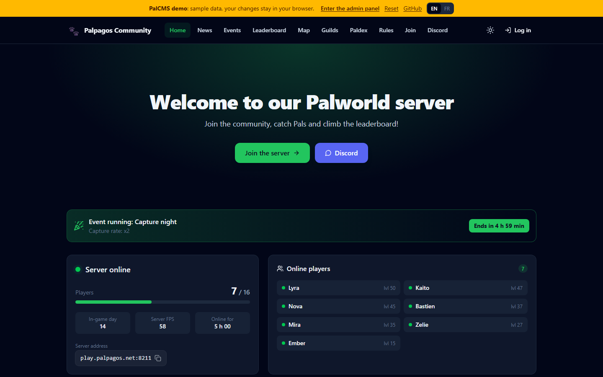
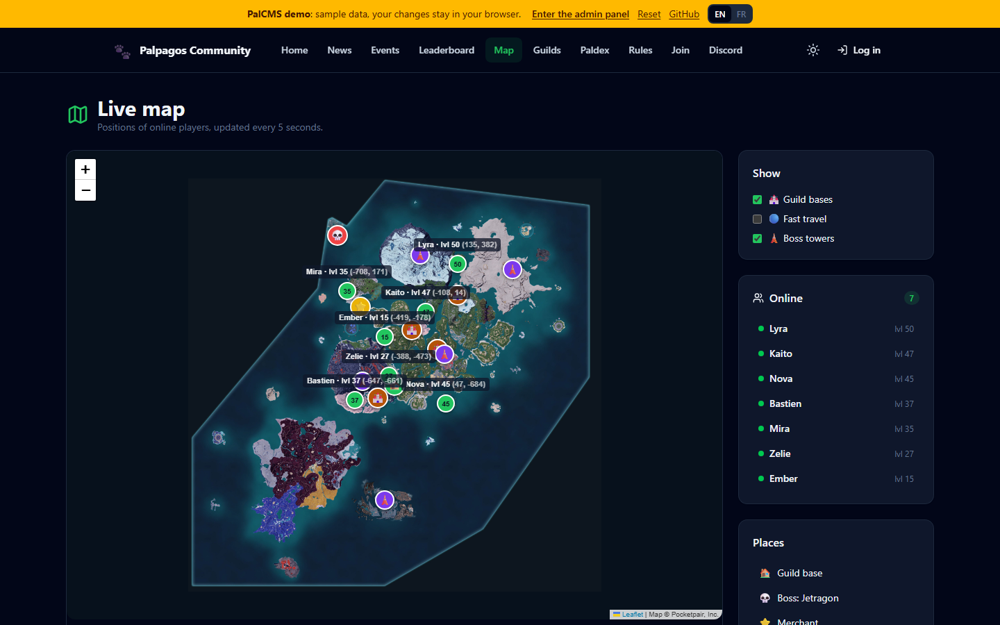
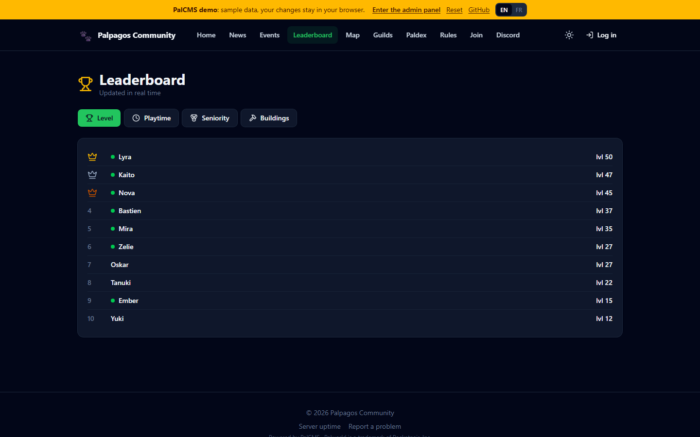
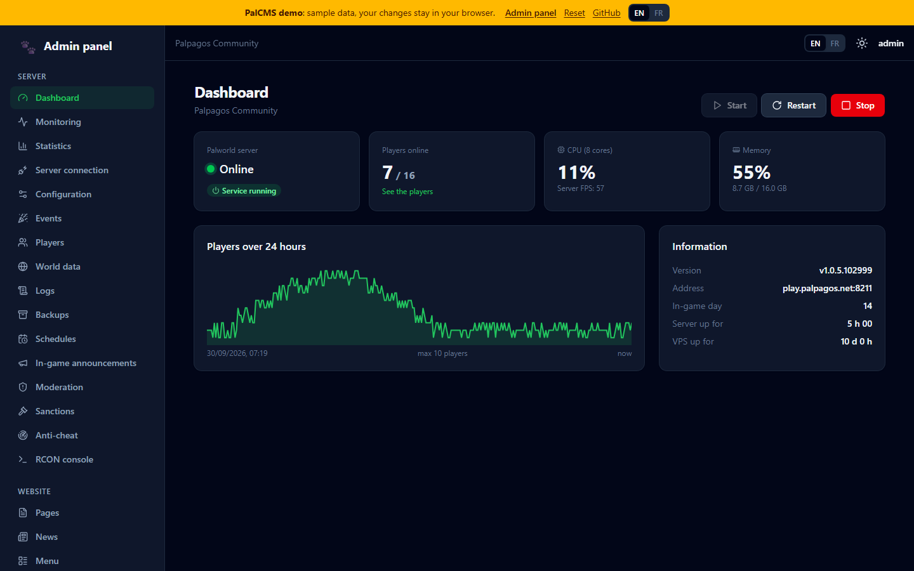
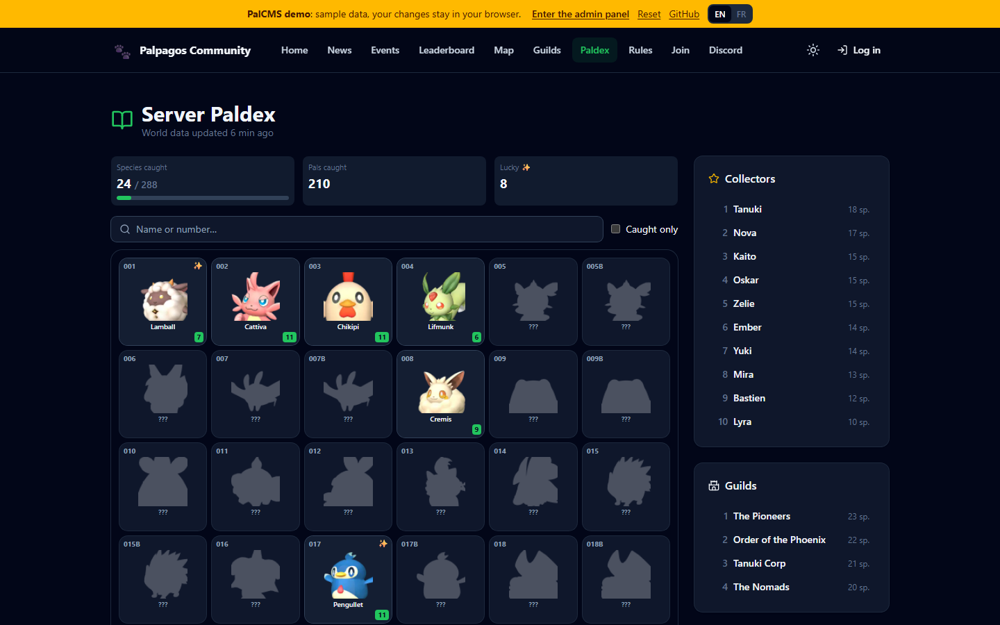

# PalCMS

🇫🇷 [Version française](README.fr.md)

**Free, open-source website + admin panel for Palworld dedicated servers.** One command on a VPS installs the site; the site then installs the game server and gives you:

- **a public website for your players**: home page, news, pages, live server status and online players, **live map** (players, bases, fast travel points), **leaderboard**, **guilds**, **server Paldex**, **events calendar**, **uptime page**, player profiles with charts, player accounts (Steam or email) showing their Pals and inventory, **reports and suggestions**;
- **an admin panel** with two areas:
  - **Server**: dashboard, **monitoring** (gauges, alerts, history), **attendance statistics**, start / stop / restart, `PalWorldSettings.ini` editor, **events and presets**, players, **world data** (inventories, Pals, guilds, item search), live logs, backups, scheduled restarts, **automatic server updates**, in-game announcements, moderation, **sanctions**, **light anti-cheat**, RCON console;
  - **Website**: pages, news, menu, appearance and themes, map, Discord (notifications and alerts), modules, members, reports;
- **a plugin and theme market**: one-click install, verified and signed packages, and a [creator kit](sdk/README.md) to build your own;
- **one-click PalCMS updates** from the panel;
- **a team with roles** (Administrator, Moderator, Editor, custom roles) and an **audit log**.

**English and French**: the interface is in English by default. The site language is chosen in the setup wizard and can be changed later in *Website > Appearance*; each visitor can also switch with the **EN / FR** button. The pages you write (news, rules, menu…) can be in any language.

**Already running a server?** Connect it through its REST API, no reinstall needed.

**MIT** license, see [LICENSE](LICENSE). Release history: [CHANGELOG.md](CHANGELOG.md).

🌐 Website: **[palcms.online](https://palcms.online/)** · ✉️ Contact: [contact@flowbric.fr](mailto:contact@flowbric.fr)

## Demo

👉 **[Try the demo](https://demo.palcms.online/)** · [open the admin panel directly](https://demo.palcms.online/admin)

The demo runs entirely in your browser with fake data (simulated players, no real Palworld server). You can change anything: your changes stay in your browser, and the "Reset" button starts over. You can even install and enable the example plugin and theme from the market.

| Public site | Live map |
|---|---|
|  |  |
| **Leaderboard** | **Admin panel** |
|  |  |
| **Paldex** | |
|  | |

---

## Installing on a VPS

**Requirements**
- Ubuntu **22.04** or **24.04**, **x86_64** CPU.
- **8 GB of RAM for the Palworld server**, 16 GB recommended above 8 players. PalCMS itself is lightweight: if you connect an existing server or only install the website, 1 GB is enough.
- 15 GB of free disk space.
- Root access (`sudo`).

**Install command**

```bash
curl -fsSL https://github.com/Flowbric-Git/palcms/releases/latest/download/install.sh | sudo bash
```

The script asks these questions in the terminal:

| Question | Example | Default |
|---|---|---|
| Domain name (empty = VPS IP) | `myserver.com` | detected IP |
| Site path | `/cms` → `https://IP/cms` | `/` |
| HTTPS | `letsencrypt` (domain), `selfsigned` or `none` | `letsencrypt` with a domain, `selfsigned` with an IP |
| Internal CMS port | `3000` | `3000` |

Each question has a matching option, for unattended installs:

```bash
curl -fsSL https://github.com/Flowbric-Git/palcms/releases/latest/download/install.sh | sudo bash -s -- --domain myserver.com --https letsencrypt --email you@example.com -y
```

At the end, the script prints the setup wizard address (`…/setup`) and a **one-time setup token**. The web wizard (English or French, button in the sidebar) then walks you through:

1. entering the token;
2. **choosing the server**:
   - **install a new Palworld server** on this VPS: a form, then SteamCMD and the server are installed with a live log;
   - **connect an existing server** (on this VPS or elsewhere): address and port of its REST API, admin password, connection test;
   - **website only**: connect a server later from *Admin panel > Server connection*;
3. creating the administrator account;
4. the site's look and language;
5. finishing, then redirecting to the site.

**Existing server**: its REST API must be enabled (`RESTAPIEnabled=True`) and reachable from the site's VPS. Status, players, map, leaderboard, statistics, moderation, announcements, Discord and RCON (if you give its port) all work. Start/stop, the config editor, logs, backups and scheduled restarts are reserved for a server installed by PalCMS, since they act directly on the server machine.

> If your host has an external firewall, open the **game port in UDP** (8211 by default, plus 27015 for the community server list) and ports **80/443 in TCP**.

**Useful commands**

```bash
sudo palcms-config edit           # change the domain, path, HTTPS or port
sudo palcms-config show           # show the configuration
sudo journalctl -u palcms -f      # CMS logs
sudo journalctl -u palworld -f    # Palworld server logs
sudo cat /var/lib/palcms/setup-token   # find the setup token again
```

- **Updating**: click "Update" in *Admin panel > Updates*, or run the install command again. The code is replaced, your data (`/var/lib/palcms`) is kept.
- **World backups** are stored in `/var/lib/palworld-backups`.

> **Coming from 1.0.x?** An existing site keeps French as its language (switch it in *Website > Appearance*). The site addresses are now in English (`/news`, `/leaderboard`, `/map`…): old links still work and redirect, and the stored menu is converted automatically.

---

## Plugins and themes

The panel includes a **Market** (*Extensions > Market*): each resource is reviewed and then signed on [palcms.online](https://palcms.online/market), and PalCMS checks that signature before installing it. Plugins are enabled and disabled in *Extensions > Plugins*; themes are chosen and customized in *Website > Themes*. A `.zip` file can also be installed directly; if it doesn't come from the market, the admin must first allow unverified extensions.

- **Build a plugin or a theme**: [sdk/README.md](sdk/README.md), with an example plugin and theme.
- **Market API format**: [docs/market-api.md](docs/market-api.md).

---

## Security

- The CMS runs as the **`palcms`** system user, never as root. Its code (`/opt/palcms`) is owned by root and can't be modified by the CMS.
- System actions go **only** through `/usr/local/lib/palcms/palctl`, the only script allowed in sudoers. It accepts a fixed list of commands and validates every argument (ports, backup names…).
- The Palworld server runs as the `steam` user. Its REST API (port 8212) and RCON port stay **local**: the firewall never opens them.
- The setup wizard requires a one-time token, then locks itself for good.
- Passwords hashed with scrypt, `HttpOnly` / `SameSite=Lax` session cookies (`Secure` over HTTPS), request origin checks (CSRF) and login rate limiting.
- Each team member only sees and does what their role allows, and every action is written to the audit log.
- Page HTML is sanitized server-side, and uploaded images are checked by their signature (no SVG).
- The public site never exposes players' Steam IDs or IPs.

---

## Development

**Requirements**: Node.js ≥ 20.12, pnpm 9 and Git. Everything works on Windows, macOS or Linux, without a VPS or a Palworld server.

```bash
pnpm install
pnpm dev
```

`pnpm dev` starts four processes:

| Process | Role |
|---|---|
| `api` | Fastify server on http://127.0.0.1:3000 |
| `web` | React site (Vite) on **http://localhost:5173** |
| `palworld` | fake Palworld server: simulated REST API with players who move and level up |
| `market` | fake market on http://127.0.0.1:3100: the example extensions, signed with a dev key |

The setup token is printed in the console. The fake `palctl` (`tools/fake-palctl`) simulates the install and backups without touching your machine.

| Command | Role |
|---|---|
| `pnpm test` | unit tests |
| `pnpm typecheck` | TypeScript checks |
| `pnpm dev:reset` | start again from a blank install |
| `pnpm release` | builds `release/palcms.tar.gz` and `release/install.sh` |
| `pnpm --filter @palcms/web dev:demo` | runs the demo (no server) on http://localhost:5173/ |
| `pnpm --filter @palcms/web build:demo` | builds the demo into `apps/web/dist-demo` (static files to host) |
| `pnpm ext build <folder>` | builds an extension (plugin or theme) into a .zip package |

The demo (`apps/web/src/demo`) replaces the API with a fake server in the browser. It is hosted on [demo.palcms.online](https://demo.palcms.online/) and is not part of the site installed on a VPS.

Test an archive on a VPS: `sudo bash install.sh --from-local palcms.tar.gz`.

**Publishing a version**: write its notes in `release-notes/v1.2.3.md`, then push the `v1.2.3` tag. The GitHub Actions workflow tests, builds and publishes the release with those notes. The repository used by `install.sh` is set with the `PALCMS_REPO` variable.

### Translations

The English text is the translation key: the code calls `t('Save')`, and `packages/shared/src/i18n/fr/` maps each English text to French (`shared.ts`: validation, permissions, settings; `server.ts`: server messages; `web.ts`: interface). Variables are written `{name}`, and a context after `|` tells identical English words apart (`'Dark|element'`).

### Structure

```
install.sh                 install on the VPS
scripts/palctl             root actions (whitelist)
scripts/palcms-config      address / path / HTTPS / Nginx
apps/server                Fastify API + SQLite
  src/setup                setup wizard (resumable steps)
  src/palworld             Palworld REST API, live tracking, ini, service
  src/routes               public API, accounts, admin
  src/features             map, leaderboard, backups, schedules, moderation,
                           RCON, Discord, team and roles, audit log, themes, market
  src/extensions           packages, signatures, install and loading of plugins
apps/web                   React + Tailwind: wizard, public site, admin panel
  src/features             matching screens
  src/demo                 fake server of the online demo
packages/shared            types, validation schemas, permissions, map conversions, translations
sdk/                       plugin and theme creator kit, with examples
tools/                     fake palctl, fake Palworld server and fake market for development
```

---

Palworld is a trademark of Pocketpair, Inc. PalCMS is an independent project, not affiliated with Pocketpair. The included map remains © Pocketpair: see [THIRD_PARTY_NOTICES.md](THIRD_PARTY_NOTICES.md).
