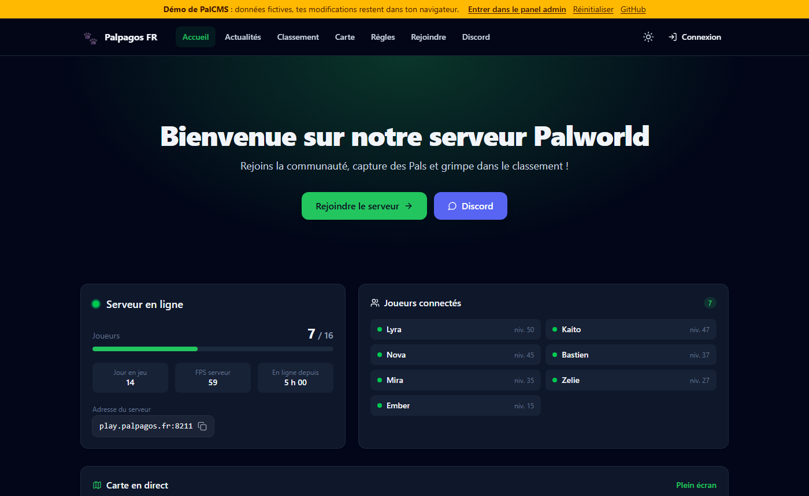
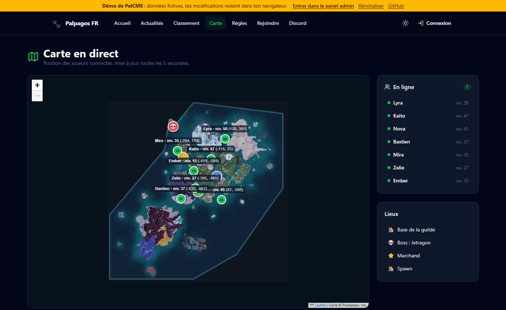
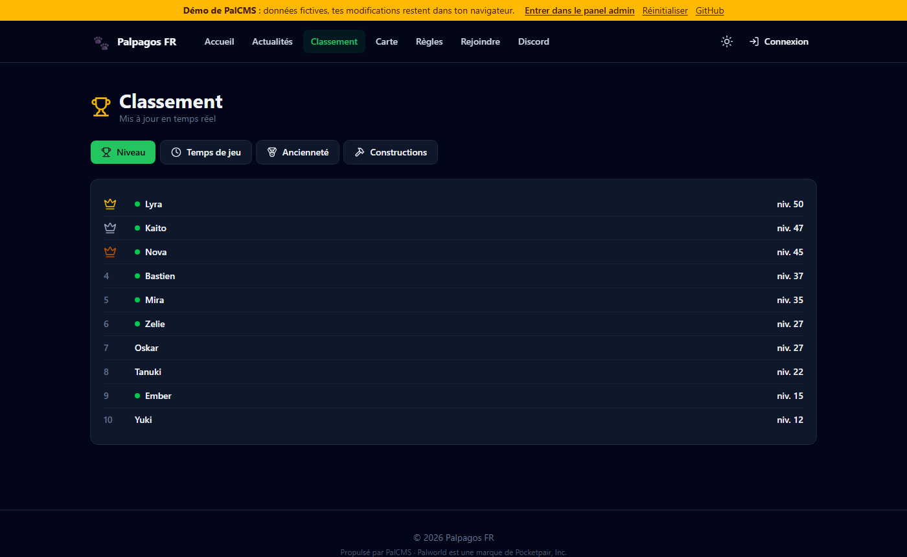
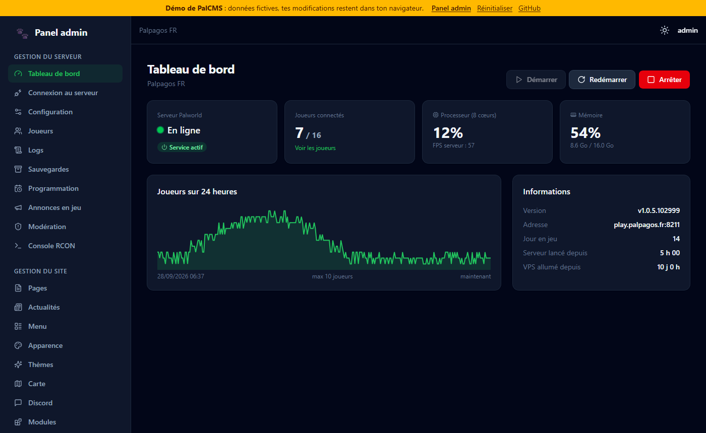
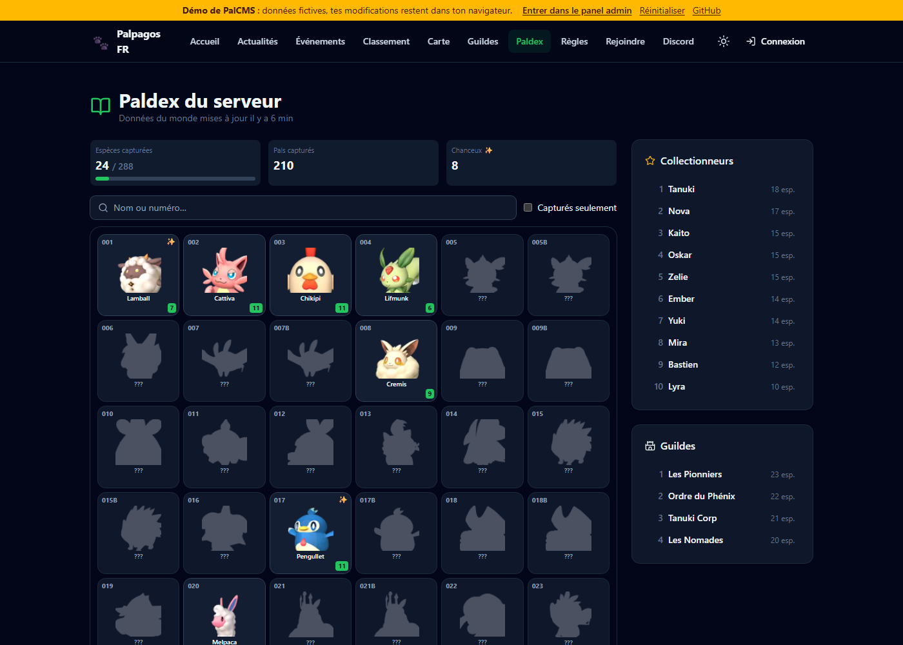

# PalCMS

**CMS open source et gratuit pour serveur dédié Palworld.** Une commande sur un VPS installe le site. Le site installe ensuite le serveur de jeu, puis offre :

- **un site public de serveur de jeu** : accueil, actualités, pages, statut et joueurs en direct, **carte en temps réel** (joueurs, bases, voyage rapide), **classement**, **guildes**, **Paldex du serveur**, **calendrier des événements**, page de **disponibilité**, profils de joueurs avec graphiques, comptes joueurs (Steam ou email) avec leurs Pals et leur inventaire, **signalements et suggestions** ;
- **un panel admin** en deux espaces :
  - **Gestion du serveur** : tableau de bord, **surveillance** (jauges, alertes, historique), **statistiques de fréquentation**, démarrer / arrêter / redémarrer, éditeur de `PalWorldSettings.ini`, **événements et préréglages**, joueurs, **données du monde** (inventaires, Pals, guildes, recherche d'objets), logs en direct, sauvegardes, redémarrages programmés, **mises à jour automatiques du serveur**, annonces en jeu, modération, **sanctions**, **anti-triche**, console RCON ;
  - **Gestion du site** : pages, actualités, menu, apparence et thèmes, carte, Discord (notifications et alertes), modules, membres, signalements ;
- **un market de plugins et de thèmes** : installation en un clic, ressources vérifiées et signées, [kit de création](sdk/README.md) pour faire les tiens ;
- **mise à jour de PalCMS en un clic** depuis le panel ;
- **une équipe avec des rôles** (Administrateur, Modérateur, Rédacteur, rôles personnalisés) et un **journal des actions**.

Licence **MIT**, voir [LICENSE](LICENSE). Historique des versions : [CHANGELOG.md](CHANGELOG.md).

🌐 Site officiel : **[palcms.online](https://palcms.online/)** · ✉️ Contact : [contact@flowbric.fr](mailto:contact@flowbric.fr)

## Démo

👉 **[Essayer la démo](https://demo.palcms.online/)** · [ouvrir directement le panel admin](https://demo.palcms.online/admin)

La démo tourne entièrement dans le navigateur avec des données fictives (joueurs simulés, pas de vrai serveur Palworld). Tu peux tout modifier : les changements restent sur ton navigateur et le bouton « Réinitialiser » remet tout à zéro.

| Site public | Carte en direct |
|---|---|
|  |  |
| **Classement** | **Panel admin** |
|  |  |
| **Paldex** | |
|  | |

---

## Installation sur un VPS

**Prérequis**
- Ubuntu **22.04** ou **24.04**, processeur **x86_64**.
- **8 Go de RAM minimum**, 16 Go conseillés pour plus de 8 joueurs.
- 15 Go d'espace disque libre.
- Un accès root (`sudo`).

**Commande d'installation**

```bash
curl -fsSL https://github.com/Flowbric-Git/palcms/releases/latest/download/install.sh | sudo bash
```

Le script pose ces questions dans le terminal :

| Question | Exemple | Par défaut |
|---|---|---|
| Nom de domaine (vide = IP du VPS) | `monserveur.fr` | IP détectée |
| Chemin du site | `/cms` → `https://IP/cms` | `/` |
| HTTPS | `letsencrypt` (domaine), `selfsigned` ou `none` | `letsencrypt` avec un domaine, `selfsigned` avec une IP |
| Port interne du CMS | `3000` | `3000` |

Chaque question a une option équivalente, pour installer sans intervention :

```bash
curl -fsSL https://github.com/Flowbric-Git/palcms/releases/latest/download/install.sh | sudo bash -s -- --ip 1.2.3.4 --path /cms --https selfsigned -y
```

À la fin, le script affiche l'adresse de l'assistant (`…/setup`) et un **jeton d'installation à usage unique**. L'assistant web enchaîne ensuite :

1. saisie du jeton ;
2. **choix du serveur** :
   - **installer un nouveau serveur Palworld** sur ce VPS : formulaire, puis installation de SteamCMD et du serveur avec le journal en direct ;
   - **connecter un serveur existant** (sur ce VPS ou ailleurs) : adresse et port de son API REST, mot de passe admin, test de connexion ;
   - **uniquement le site** : tu connecteras un serveur plus tard dans *Panel admin > Connexion au serveur* ;
3. création du compte administrateur ;
4. apparence du site ;
5. finalisation, puis redirection vers le site.

**Serveur existant** : son API REST doit être activée (`RESTAPIEnabled=True`) et joignable depuis le VPS du site. Statut, joueurs, carte, classement, statistiques, modération, annonces, Discord et RCON (si tu indiques son port) fonctionnent. Le démarrage, l'éditeur de configuration, les logs, les sauvegardes et les redémarrages programmés restent réservés à un serveur installé par PalCMS, puisqu'ils agissent directement sur la machine du serveur.

> Si ton hébergeur a un pare-feu externe, ouvre le **port de jeu en UDP** (8211 par défaut) et les ports **80/443 en TCP**.

**Commandes utiles**

```bash
sudo palcms-config edit           # changer le domaine, le chemin, le HTTPS ou le port
sudo palcms-config show           # afficher la configuration
sudo journalctl -u palcms -f      # logs du CMS
sudo journalctl -u palworld -f    # logs du serveur Palworld
sudo cat /var/lib/palcms/setup-token   # retrouver le jeton d'installation
```

- **Mise à jour** : relancer la commande d'installation. Le code est remplacé, les données (`/var/lib/palcms`) sont conservées.
- **Sauvegardes du monde** : elles sont stockées dans `/var/lib/palworld-backups`.

---

## Plugins et thèmes

Le panel propose un **Market** (*Extensions > Market*) : chaque ressource est validée puis signée sur [palcms.online](https://palcms.online/), et PalCMS vérifie cette signature avant de l’installer. Les plugins s’activent et se désactivent dans *Extensions > Plugins*, les thèmes se choisissent et se personnalisent dans *Gestion du site > Thèmes*. Un fichier `.zip` peut aussi être installé directement ; s’il ne vient pas du market, l’admin doit d’abord autoriser les extensions non vérifiées.

- **Créer un plugin ou un thème** : [sdk/README.md](sdk/README.md), avec un plugin et un thème d’exemple.
- **Format de l’API du market** : [docs/market-api.md](docs/market-api.md).

---

## Sécurité

- Le CMS tourne sous l'utilisateur système **`palcms`**, jamais en root. Son code (`/opt/palcms`) appartient à root et ne peut pas être modifié par le CMS.
- Les actions système passent **uniquement** par `/usr/local/lib/palcms/palctl`, seul script autorisé par sudoers. Il accepte une liste fixe de commandes et vérifie chaque argument (ports, noms de sauvegardes…).
- Le serveur Palworld tourne sous l'utilisateur `steam`. Son API REST (port 8212) et son port RCON restent **locaux** : le pare-feu ne les ouvre jamais.
- L'assistant d'installation exige un jeton à usage unique, puis se verrouille définitivement.
- Mots de passe hachés avec scrypt, sessions en cookie `HttpOnly` / `SameSite=Lax` (`Secure` en HTTPS), vérification de l'origine des requêtes (anti-CSRF) et limitation du nombre de tentatives de connexion.
- Chaque membre de l'équipe ne voit et ne peut faire que ce que son rôle autorise, et chaque action est inscrite dans le journal.
- Le HTML des pages est nettoyé côté serveur, et les images envoyées sont vérifiées par leur signature (pas de SVG).
- Le site public n'expose jamais les Steam ID ni les IP des joueurs.

---

## Développement

**Outils nécessaires** : Node.js ≥ 20.12, pnpm 9 et Git. Tout fonctionne sous Windows, macOS ou Linux, sans VPS ni serveur Palworld.

```bash
pnpm install
pnpm dev
```

`pnpm dev` lance quatre processus :

| Processus | Rôle |
|---|---|
| `api` | serveur Fastify sur http://127.0.0.1:3000 |
| `web` | site React (Vite) sur **http://localhost:5173** |
| `palworld` | faux serveur Palworld : API REST simulée, avec des joueurs qui bougent et gagnent des niveaux |
| `market` | faux market sur http://127.0.0.1:3100 : les extensions d’exemple, signées avec une clé de dev |

Le jeton d'installation s'affiche dans la console. Le faux `palctl` (`tools/fake-palctl`) simule l'installation et les sauvegardes sans toucher à ta machine.

| Commande | Rôle |
|---|---|
| `pnpm test` | tests unitaires |
| `pnpm typecheck` | vérification TypeScript |
| `pnpm dev:reset` | repartir d'une installation vierge |
| `pnpm release` | construit `release/palcms.tar.gz` et `release/install.sh` |
| `pnpm --filter @palcms/web dev:demo` | lance la démo (sans serveur) sur http://localhost:5173/ |
| `pnpm --filter @palcms/web build:demo` | construit la démo dans `apps/web/dist-demo` (fichiers statiques à héberger) |
| `pnpm ext build <dossier>` | construit une extension (plugin ou thème) en paquet .zip |

La démo (`apps/web/src/demo`) remplace l'API par un faux serveur dans le navigateur. Elle est hébergée sur [demo.palcms.online](https://demo.palcms.online/) et n'est pas incluse dans le site installé sur un VPS.

Tester une archive sur un VPS : `sudo bash install.sh --from-local palcms.tar.gz`.

**Publier une version** : pousser un tag `v1.0.0`. Le workflow GitHub Actions teste, construit et publie la release. Le dépôt utilisé par `install.sh` se règle dans la variable `PALCMS_REPO`.

### Structure

```
install.sh                 installation sur le VPS
scripts/palctl             actions root (liste blanche)
scripts/palcms-config      adresse / chemin / HTTPS / Nginx
apps/server                API Fastify + SQLite
  src/setup                assistant d'installation (étapes reprenables)
  src/palworld             API REST Palworld, suivi en direct, ini, service
  src/routes               API publique, comptes, admin
  src/features             carte, classement, sauvegardes, programmation, modération,
                           RCON, Discord, équipe et rôles, journal, thèmes, market
  src/extensions           paquets, signatures, installation et chargement des plugins
apps/web                   React + Tailwind : assistant, site public, panel admin
  src/features             écrans correspondants
  src/demo                 faux serveur de la démo en ligne
packages/shared            types, schémas de validation, permissions, conversions de la carte
sdk/                       kit de création des plugins et thèmes, avec des exemples
tools/                     faux palctl, faux serveur Palworld et faux market pour le développement
```

---

Palworld est une marque de Pocketpair, Inc. PalCMS est un projet indépendant, sans lien avec Pocketpair. La carte incluse reste © Pocketpair : voir [THIRD_PARTY_NOTICES.md](THIRD_PARTY_NOTICES.md).
